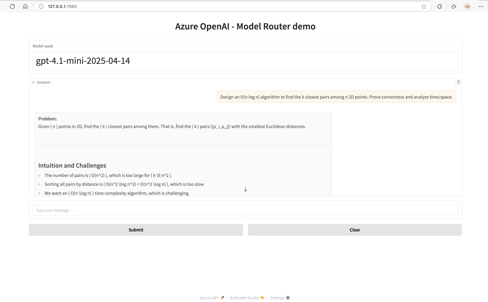
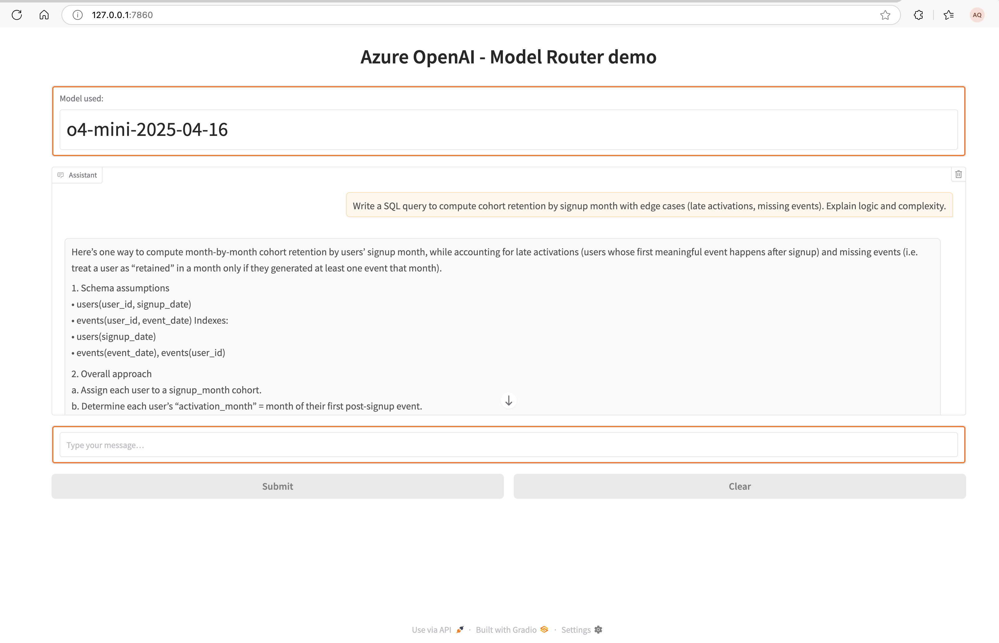

# Model Router (Azure AI Foundry)

This repo demonstrates the Azure AI Foundry model router: a single, deployable chat model that automatically selects the most suitable underlying model per request to balance quality, cost, and latency. You call one model name (for example, `model-router`) and the router picks the best target behind the scenes.

## What is the Azure model router?

- A composite chat model that routes each prompt to an underlying LLM based on factors like task complexity, reasoning needs, response length, modality (text vs. vision), latency targets, and budget.
- You get one endpoint and one deployment to manage, while still benefiting from multiple foundation models.
- Benefits:
  - Simpler integration (one model name)
  - Better cost control (small/fast models for easy tasks)
  - Consistent quality (larger or reasoning models when needed)
  - Future-ready (router can incorporate new models as they become available in your workspace)

## Which models can it route to?

The exact set depends on what’s enabled in your Azure AI Foundry project and region. Common examples include:

- GPT-4.1 series (e.g., GPT-4.1 2025-04-14)
- GPT-4.1-mini
- GPT-4.1-nano
- o4-mini

Your environment may also include other families (for example, “gpt-5-chat” or “gpt-5 reasoning”) if available. The included examples and prompts are written to exercise a mix of small/fast, general chat, high-capability, and deep-reasoning routes.

### Typical routing patterns
- Short transforms, classification, extraction → o4-mini (fast, low-cost)
- General chat, polished writing, light coding → chat-oriented models (e.g., gpt-5-chat, if available)
- Deep/step-by-step reasoning, complex math/logic → reasoning models (if available)
- Multimodal or long, structured synthesis → GPT-4.1 series

## When to use the model router
- Mixed workloads where prompt difficulty varies widely across requests
- Cost-sensitive apps that should default to small models but “boost” when needed
- Customer support assistants (fast routing for FAQs; bigger models for tricky cases)
- Content generation pipelines with guardrails on latency and spend
- Vision or document-analysis scenarios alongside regular text chat

## Repo structure

- app/
  - gradio_app.py — Gradio chat UI that streams tokens and shows the “Model used” returned by the API
- examples/
  - foundry_sample.py — Minimal script that prints the routed model
  - prompts/ — Prompt sets designed to exercise different routing outcomes
- notebooks/
  - model-router.ipynb — Walkthrough notebook with examples and guidance
- env.sample — Copy to .env and set `azure_openai_endpoint`
- .gitignore — Keeps `.env` and `.venv` out of git

## Quickstart

1) Configure environment
   - Copy `env.sample` → `.env` and set:
     - `azure_openai_endpoint="https://YOUR-RESOURCE.openai.azure.com/"`

2) Install dependencies
   - Create/activate a virtual environment and install packages from `requirements.txt`.

3) Run the Gradio demo
   - `python app/gradio_app.py`
   - The header shows which underlying model the router selected while streaming.

### UI preview

Tips to capture:
- macOS screenshot: Shift+Cmd+4
- Quick GIF: QuickTime screen recording + convert to GIF (for example, via gifski or an online converter)

1) Or run the simple sample
   - `python examples/foundry_sample.py`
   - The script prints the assistant’s reply and the model that served it.

## Authentication and config
- Samples use Entra ID via `DefaultAzureCredential` and request a token for scope `https://cognitiveservices.azure.com/.default`.
- Ensure your identity has access to the Azure OpenAI resource behind `azure_openai_endpoint`.
- API version in samples: `2025-01-01-preview`.

## How to verify routing
- Gradio app: the “Model used” field updates during streaming using `chunk.model`.
- Script/notebook: prints `response.model` so you can see which model actually served the request.

## Notes
- Availability of specific routed models varies by region and subscription. Adjust prompts in `examples/prompts/` to steer routing (speed vs. depth, simple vs. complex, text-only vs. multimodal).
